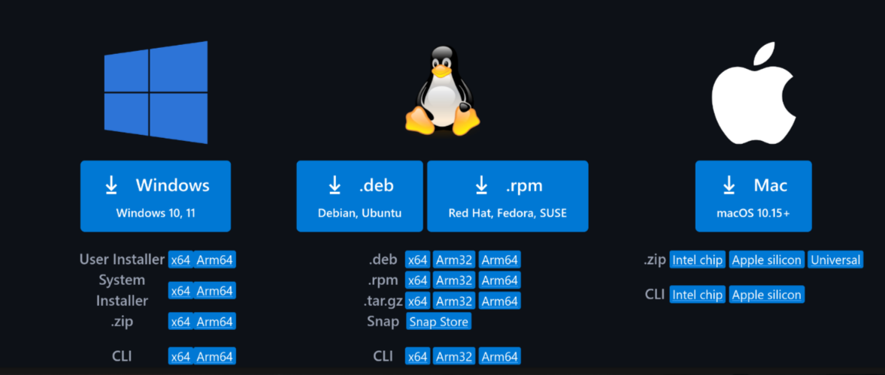
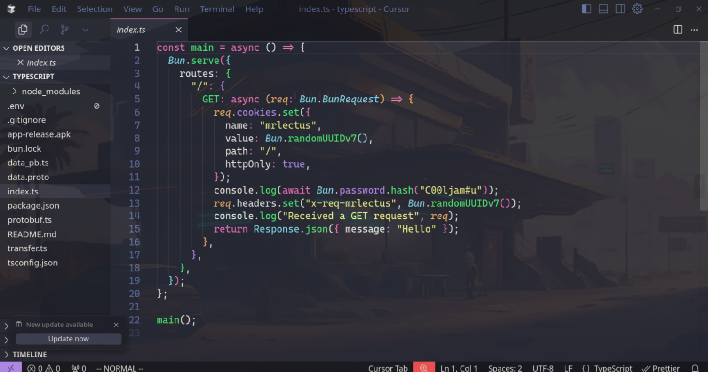
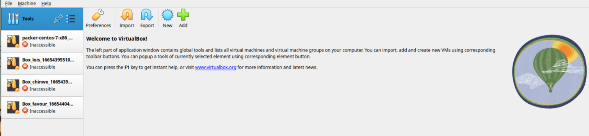
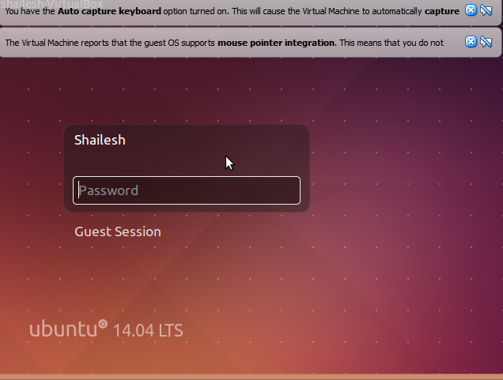

Installing Git
Windows:

    Download Git from the official website: https://git-scm.com/download/windows
    Run the installer (.exe file)
    Follow the setup wizard:
        Choose installation location (default is fine)
        Select components (keep defaults, ensure "Git Bash Here" is checked)
        Choose default editor (VS Code is a good option if you plan to install it)
        Choose initial branch name (main is recommended)
        Adjust PATH environment (recommended: "Git from the command line and also from 3rd-party software")
        Choose HTTPS transport backend (use OpenSSL)
        Configure line ending conversions (recommended: "Checkout Windows-style, commit Unix-style")
        Choose terminal emulator (MinTTY is fine)
        Configure extra options (enable file system caching, enable Git Credential Manager)
    Complete installation and verify by opening Command Prompt/PowerShell and typing git --version

macOS:

    Option 1 - Homebrew (recommended):
        Install Homebrew first: /bin/bash -c "$(curl -fsSL https://raw.githubusercontent.com/Homebrew/install/HEAD/install.sh)"
        Install Git: brew install git
    Option 2 - Official installer:
        Download from https://git-scm.com/download/mac
        Run the .pkg installer and follow instructions
    Verify installation: git --version in Terminal

Linux (Ubuntu/Debian):

bash

sudo apt update
sudo apt install git

Linux (CentOS/RHEL/Fedora):

bash

# CentOS/RHEL
sudo yum install git
# or for newer versions
sudo dnf install git

# Fedora
sudo dnf install git

Installing VS Code
Windows:

    Go to https://code.visualstudio.com/
    Click "Download for Windows"
    Run the installer (.exe file)
    Setup options:
        Accept license agreement
        Choose installation location
        Important: Check "Add to PATH" option
        Check "Create a desktop icon" if desired
        Check "Add 'Open with Code' action to Windows Explorer file context menu"
        Check "Add 'Open with Code' action to Windows Explorer directory context menu"
    Complete installation

macOS:

    Download from https://code.visualstudio.com/
    Open the downloaded .zip file
    Drag Visual Studio Code.app to Applications folder
    Launch VS Code from Applications
    To use code command in terminal: Open Command Palette (Cmd+Shift+P) → type "Shell Command: Install 'code' command in PATH"

Linux:

Ubuntu/Debian:

bash

wget -qO- https://packages.microsoft.com/keys/microsoft.asc | gpg --dearmor > packages.microsoft.gpg
sudo install -o root -g root -m 644 packages.microsoft.gpg /etc/apt/trusted.gpg.d/
sudo sh -c 'echo "deb [arch=amd64,arm64,armhf signed-by=/etc/apt/trusted.gpg.d/packages.microsoft.gpg] https://packages.microsoft.com/repos/code stable main" > /etc/apt/sources.list.d/vscode.list'
sudo apt update
sudo apt install code

Fedora/CentOS/RHEL:

bash

sudo rpm --import https://packages.microsoft.com/keys/microsoft.asc
sudo sh -c 'echo -e "[code]\nname=Visual Studio Code\nbaseurl=https://packages.microsoft.com/yumrepos/vscode\nenabled=1\ngpgcheck=1\ngpgkey=https://packages.microsoft.com/keys/microsoft.asc" > /etc/yum.repos.d/vscode.repo'
sudo dnf install code

Installing VirtualBox
Windows:

    Go to https://www.virtualbox.org/wiki/Downloads
    Click "Windows hosts" to download the installer
    Run the installer (.exe file)
    Installation wizard:
        Choose installation location
        Select features (keep all defaults)
        Warning: Network interfaces will be reset briefly during installation
        Proceed with installation (may require administrator privileges)
        Install device software when prompted
    Restart computer if prompted
    Launch VirtualBox to verify installation

macOS:

    Download from https://www.virtualbox.org/wiki/Downloads (macOS hosts)
    Open the downloaded .dmg file
    Double-click VirtualBox.pkg
    Follow installation instructions
    Important: You may need to allow the system extension in System Preferences → Security & Privacy
    If prompted about kernel extensions, go to System Preferences → Security & Privacy → General tab and click "Allow"

Linux:

Ubuntu/Debian:

bash

# Add Oracle's repository key
wget -q https://www.virtualbox.org/download/oracle_vbox_2016.asc -O- | sudo apt-key add -

# Add repository
echo "deb [arch=amd64] https://download.virtualbox.org/virtualbox/debian $(lsb_release -cs) contrib" | sudo tee /etc/apt/sources.list.d/virtualbox.list

# Update and install
sudo apt update
sudo apt install virtualbox-7.0

Fedora/CentOS/RHEL:

bash

# Add repository
sudo dnf config-manager --add-repo=https://download.virtualbox.org/virtualbox/rpm/fedora/virtualbox.repo

# Install
sudo dnf install VirtualBox-7.0

Post-Installation Setup
Git Configuration:

bash

git config --global user.name "Your Name"
git config --global user.email "your.email@example.com"
git config --global init.defaultBranch main

VS Code Extensions (recommended):

    GitLens — Git supercharged
    Prettier - Code formatter
    ESLint
    Auto Rename Tag
    Bracket Pair Colorizer
    Live Server

VirtualBox:

    Download VirtualBox Extension Pack from the same download page for additional features
    Install it through VirtualBox → File → Preferences → Extensions

Step 1: Create a New Virtual Machine

Open VirtualBox and click "New" button
Name and Operating System:

Name: Ubuntu Desktop (or your preferred name)
Machine Folder: Leave default or choose custom location
Type: Linux
Version: Ubuntu (64-bit)
Click "Next"

Memory Size:

Recommended: 4096 MB (4GB) minimum
For better performance: 8192 MB (8GB) or more
Don't exceed 50% of your host machine's RAM
Click "Next"

Hard Disk:

Select "Create a virtual hard disk now"
Click "Create"

Hard Disk File Type:

Select "VDI (VirtualBox Disk Image)"
Click "Next"

Storage on Physical Hard Disk:

Select "Dynamically allocated" (recommended)
Click "Next"

File Location and Size:

Set size to at least 25GB (recommended: 50GB+)
Click "Create"

Step 2: Configure Virtual Machine Settings

Select your VM and click "Settings"
System Settings:

Motherboard tab:

Boot Order: Check "Optical" and move it above "Hard Disk"
Enable "Enable I/O APIC"

Processor tab:

CPUs: 2 or more (don't exceed half of your host CPUs)
Enable "Enable PAE/NX"

Acceleration tab:

Enable "VT-x/AMD-V" if available
Enable "Nested Paging" if available

Display Settings:

Video Memory: 128 MB (maximum available)
Enable "Enable 3D Acceleration"
Monitor Count: 1

Storage Settings:

Click on "Empty" under "Controller: IDE"
Click the CD icon next to "Optical Drive"
Select "Choose a disk file..."
Browse and select your Ubuntu ISO file
Click "OK"

Network Settings:

Adapter 1: Enable Network Adapter
Attached to: "NAT" (default is fine)

Click "OK" to save settings

Step 3: Install Ubuntu

Start the VM by selecting it and clicking "Start"
Ubuntu Boot Menu:

Select "Try or Install Ubuntu"
Press Enter

Ubuntu Installer Welcome Screen:

Choose your language
Click "Install Ubuntu"

Keyboard Layout:

Select your keyboard layout
Click "Continue"

Updates and Other Software:

Choose "Normal installation"
Check "Download updates while installing Ubuntu"
Check "Install third-party software..." (for graphics, Wi-Fi, etc.)
Click "Continue"

Installation Type:

Select "Erase disk and install Ubuntu"
Click "Install Now"
Click "Continue" to confirm changes

Where Are You:

Select your time zone
Click "Continue"

Who Are You:

Your name: Enter your full name
Computer's name: Enter hostname (or keep default)
Username: Enter username (lowercase, no spaces)
Password: Enter strong password
Confirm password
Choose "Log in automatically" or "Require password"
Click "Continue"

Installation Process:

Wait for installation to complete (15-30 minutes)
The installer will show progress and Ubuntu features

Installation Complete:

Click "Restart Now"
Press Enter when prompted to remove installation medium

Step 4: First Boot and Initial Setup

Login with your credentials
Complete Setup Wizard:

Connect to online accounts (optional)
Enable Ubuntu Pro (optional)
Help improve Ubuntu (choose preference)
Privacy settings
Ready to go!

Step 5: Install VirtualBox Guest Additions
Guest Additions improve performance and add features like:

Better video resolution support
Seamless mouse integration
Shared clipboard
Shared folders

Method 1: Using the GUI

In VirtualBox menu: Devices → Insert Guest Additions CD image
Ubuntu will prompt to run the software
Click "Run" and enter your password
Wait for installation to complete
Restart the VM

[!Aws Home page](./assets/aws_home.png)
