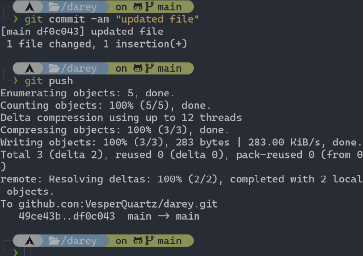

Managing a Git repository between teams using pull requests is a collaborative workflow that ensures code quality, enables peer review, and maintains project stability. Here's how the process typically works:
Basic Workflow Structure
Most teams use a branching strategy where the main branch (usually main or master) contains production-ready code, and all new work happens on feature branches. Developers create pull requests to merge their changes back into the main branch.

[Git Repo](https://github.com/VesperQuartz/darey)

